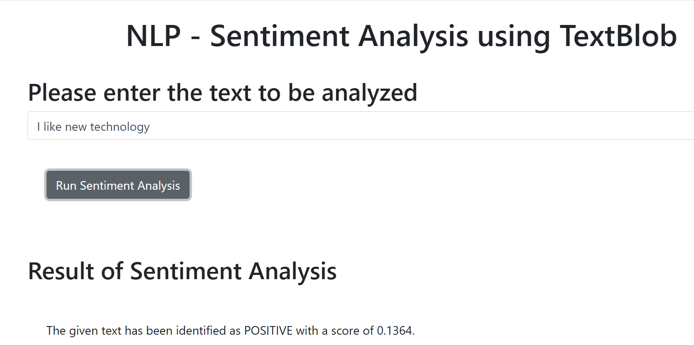
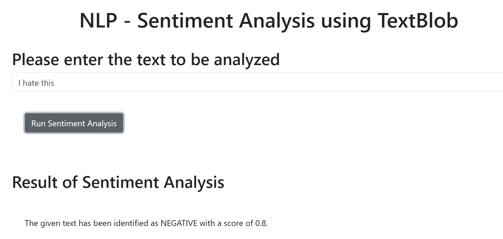
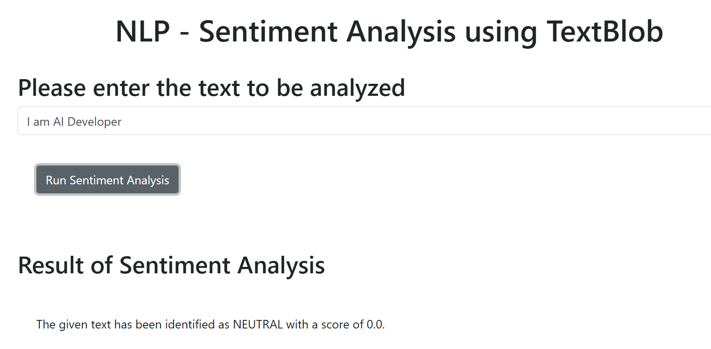

# 📊 TextBlob Sentiment Analyzer

The script analyzes a given piece of text and classifies the sentiment as **positive**, **negative**, or **neutral**, while returning a corresponding **sentiment score**.

---

## 🚀 Features

- Analyze sentiment from input text
- Return a sentiment label: `POSITIVE`, `NEGATIVE`, or `NEUTRAL`
- Output a score indicating sentiment strength
- Includes unit tests with `unittest`

---

## 🛠️ Installation

1. Clone this repository:
   ```bash
   git clone https://github.com/shahzad-bangash/TextBlob-Sentiment-Analyzer
   cd TextBlob-Sentiment-Analyzer

2. run server.py script

## Project Showcase

1. POSITIVE Score



2. NEGATIVE Score



3. NEUTRAL Score




